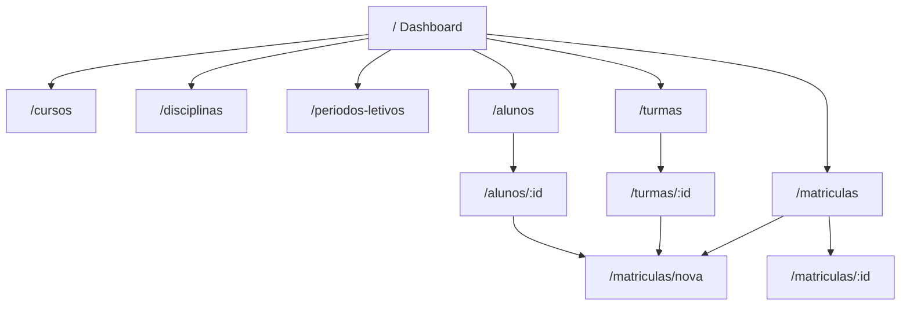

# Documento 24 — Navegação, Telas e Fluxos

> Versão: 1.0
>
> Fase: Análise / UX
>
> Status: Aprovado

---

# 1. Objetivo

Este documento define o mapa de navegação, o inventário de telas e os fluxos de usuário do frontend Angular do Sistema Acadêmico.

Todo o escopo de UI aqui descrito é rastreável aos casos de uso do [Documento 09](09%20-%20Casos%20de%20Uso.md) e à arquitetura do [Documento 23](23%20-%20Arquitetura%20do%20Frontend.md).

A UI **não introduz** entidades nem operações fora do MVP ([Documento 21](21%20-%20Plano%20de%20Evolução%20do%20Sistema.md), §3).

---

# 2. Decisões de navegação

| # | Decisão | Escolha |
|---|---------|---------|
| 1 | Padrão CRUD | **Lista + Detalhe + Formulário** |
| 2 | Matrícula | Área **Matrículas** no menu + atalhos nos detalhes de Aluno e Turma |
| 3 | Início | **Dashboard** com cards/atalhos (contadores) |

---

# 3. Menu principal

```text
Início | Cursos | Disciplinas | Períodos Letivos | Alunos | Turmas | Matrículas
```

A ordem segue a dependência do domínio: cadastros base → oferta (turmas) → matrícula.

Não há autenticação no MVP ([Documento 20](20%20-%20Segurança.md)): todos os itens do menu são acessíveis.

---

# 4. Padrão de telas CRUD

Aplicável a: **Curso**, **Disciplina**, **Período Letivo**, **Aluno** e **Turma**.

| Tela | Rota (padrão) | Casos de uso |
|------|---------------|--------------|
| Lista | `/{recurso}` | `Listar*` (filtros do Documento 09, §4.5) |
| Detalhe | `/{recurso}/:id` | `Buscar*PorId`; exclusão; vínculos e ações de negócio |
| Novo | `/{recurso}/novo` | `Cadastrar*` |
| Editar | `/{recurso}/:id/editar` | `Atualizar*` (formulário carregado via `Buscar*PorId`) |

**Turma — ações extras no detalhe:** AbrirTurma, FecharTurma; bloco de matrículas da turma.

**Aluno — no detalhe:** bloco de matrículas do aluno.

A exclusão ocorre a partir do detalhe, com confirmação explícita do usuário.

---

# 5. Inventário de rotas

## 5.1 Início

| Rota | Tela | Conteúdo |
|------|------|----------|
| `/` | Dashboard | Cards com contadores e atalhos (ex.: total de alunos, turmas abertas, matrículas pendentes, link “Nova matrícula”) |

Os contadores consomem listagens/consultas já existentes da API (**sem** endpoint novo de “dashboard” no MVP). Se a agregação ficar custosa na implementação, os cards podem usar contagens derivadas das listagens ou exibir atalhos sem número — detalhe no [Documento 27](27%20-%20Comunicação%20com%20a%20API.md).

## 5.2 Cadastros (padrão CRUD)

| Recurso | Base da rota | Observação |
|---------|--------------|------------|
| Cursos | `/cursos` | Lista, detalhe, novo, editar |
| Disciplinas | `/disciplinas` | Filtro `cursoId` na lista |
| Períodos Letivos | `/periodos-letivos` | Filtros de data (Documento 09, §4.5) |
| Alunos | `/alunos` | Detalhe com bloco de matrículas |
| Turmas | `/turmas` | Detalhe: Abrir/Fechar + matrículas; lista pode atalhar “disponíveis” |

Rotas por recurso:

```text
/{recurso}
/{recurso}/novo
/{recurso}/:id
/{recurso}/:id/editar
```

## 5.3 Matrículas

Matrícula **não** segue o padrão CRUD com `/:id/editar`: apenas lista, nova e detalhe (ações confirmar/cancelar no detalhe).

| Rota | Tela | Casos de uso |
|------|------|--------------|
| `/matriculas` | Lista (filtros: status, aluno, turma) | `ListarMatriculas` |
| `/matriculas/nova` | Realizar matrícula (aluno + turma; apoio a turmas disponíveis) | `RealizarMatricula`, `ConsultarTurmasDisponiveis` |
| `/matriculas/:id` | Detalhe | `BuscarMatriculaPorId`, `ConfirmarMatricula`, `CancelarMatricula` |

**Atalhos:**

- Detalhe do aluno → lista de matrículas do aluno (`ConsultarMatriculasPorAluno`) + “Nova matrícula” (aluno pré-selecionado);
- Detalhe da turma → lista de matrículas da turma (`ConsultarMatriculasPorTurma`) + “Nova matrícula” (turma pré-selecionada).

**Turmas disponíveis:** não exigem item próprio no menu. São apoio em **Matrículas → Nova** (e, opcionalmente, filtro/atalho na lista de Turmas), cobrindo `ConsultarTurmasDisponiveis`.

---

# 6. Mapa de navegação



---

# 7. Fluxos de usuário críticos

## 7.1 Ciclo de matrícula

1. O usuário abre **Matrículas → Nova** (ou o atalho no detalhe do aluno/turma).
2. Seleciona aluno e turma (turma preferencialmente entre as **disponíveis**: aberta e com vagas).
3. O sistema chama RealizarMatricula → status inicial `PENDENTE`.
4. No detalhe da matrícula (ou na lista), o usuário **Confirma** → status `CONFIRMADA` (consumo de vaga no domínio).
5. Opcionalmente, **Cancela** → status `CANCELADA` (liberação de vaga quando aplicável).

As regras “turma deve estar aberta”, “há vagas” e “não há duplicidade” **não** são reimplementadas na UI: a API responde com erro (`ProblemDetail`). O tratamento visual fica no [Documento 26](26%20-%20Estados%20da%20Interface%20e%20Erros.md).

## 7.2 Abrir / fechar turma

1. O usuário abre o detalhe da turma.
2. Executa **Abrir** ou **Fechar**.
3. A UI atualiza o status exibido conforme a resposta da API.

## 7.3 Cadastro base antes da matrícula

Orientação sugerida no dashboard (não é trava de navegação):

```text
Curso / Disciplina / Período Letivo → Turma (aberta) → Aluno → Matrícula
```

---

# 8. Rastreabilidade tela → caso de uso

| Área | Telas | Casos de uso (Documento 09) |
|------|-------|------------------------------|
| Cursos | lista, detalhe, formulário | CRUD Curso |
| Disciplinas | lista, detalhe, formulário | CRUD Disciplina |
| Períodos Letivos | lista, detalhe, formulário | CRUD Período Letivo |
| Alunos | lista, detalhe, formulário + bloco matrículas | CRUD Aluno; ConsultarMatriculasPorAluno |
| Turmas | lista, detalhe, formulário + Abrir/Fechar + bloco matrículas | CRUD Turma; AbrirTurma; FecharTurma; ConsultarMatriculasPorTurma; atalho ConsultarTurmasDisponiveis |
| Matrículas | lista, nova, detalhe | RealizarMatricula; ConfirmarMatricula; CancelarMatricula; consultas; turmas disponíveis |
| Dashboard | `/` | Agrega consultas existentes (sem novo caso de uso de domínio) |

---

# 9. Fora de escopo

- Login, perfis e RBAC (Documento 20 / evolução);
- Paginação de listas (curto prazo — Documento 21, §4.1);
- Fechamento de período letivo (médio prazo — Documento 21);
- Visual, tokens, responsividade, acessibilidade e movimento → **[Documento 25](25%20-%20Layout,%20Design%20System%20e%20UX.md)**;
- Estados de UI (loading, vazio, erro) e mapeamento de `ProblemDetail` → **[Documento 26](26%20-%20Estados%20da%20Interface%20e%20Erros.md)**;
- Contratos HTTP detalhados → **[Documento 27](27%20-%20Comunicação%20com%20a%20API.md)**;
- Árvore de pastas e naming → **[Documento 28](28%20-%20Componentização%20e%20Estrutura%20do%20Projeto.md)**;
- Testes e roadmap do frontend → **[Documento 29](29%20-%20Testes%20e%20Roadmap%20do%20Frontend.md)**.

---

# 10. Relação com outros documentos

| Documento | Relação |
|-----------|---------|
| 02 — Linguagem Ubíqua | Labels e nomes na UI |
| 09 — Casos de Uso | Fonte dos casos de uso e filtros |
| 21 — Plano de Evolução | Limites do MVP |
| 23 — Arquitetura do Frontend | SPA Angular, features, estado local |
| 25–29 | UX, erros, API, pastas, testes/roadmap |

---

# 11. Considerações finais

Alterações no mapa de rotas, no padrão Lista/Detalhe/Formulário ou na localização da matrícula devem atualizar este documento e, se mudarem decisões arquiteturais da UI, o [Documento 22 — ADR](22%20-%20Registro%20de%20Decisões%20Arquiteturais%20(ADR).md).
