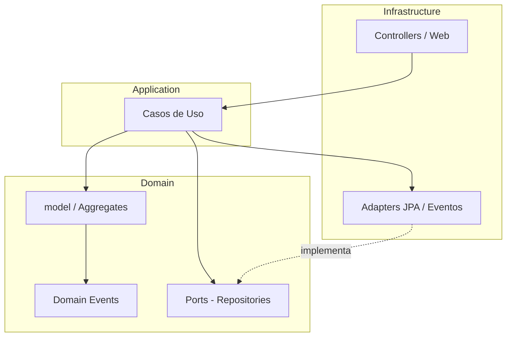
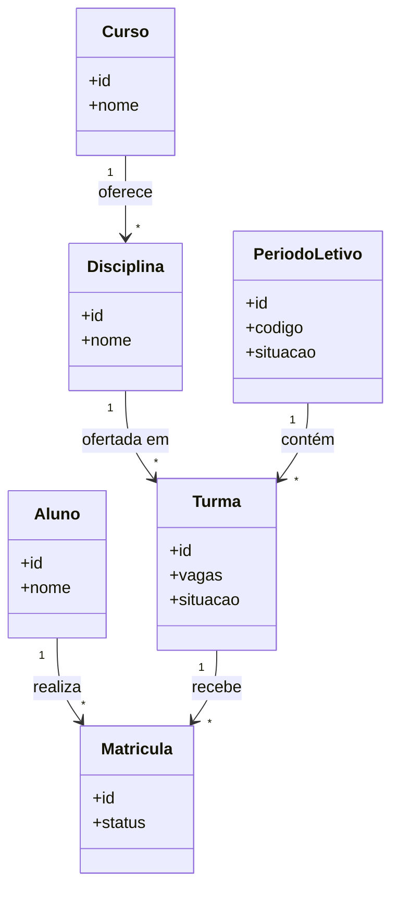
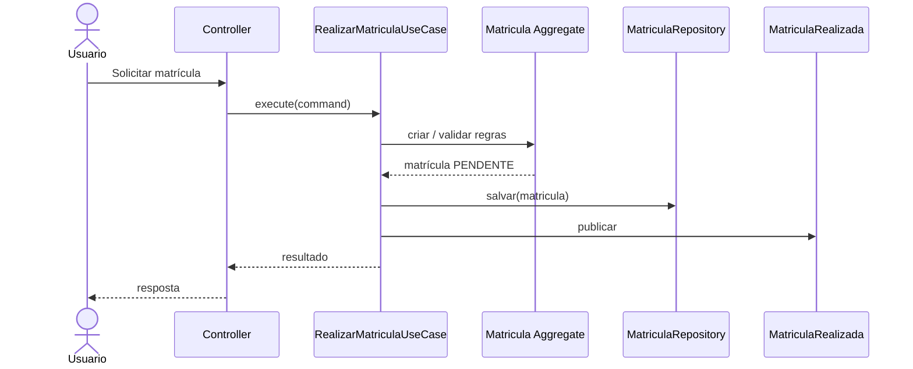
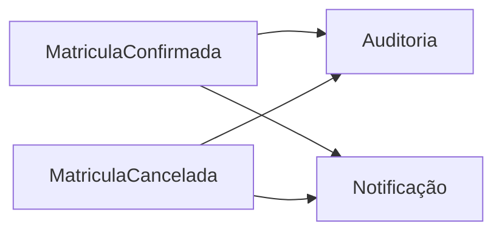

# Sistema Acadêmico

> Projeto desenvolvido para demonstrar a aplicação de Domain-Driven Design (DDD), Arquitetura Hexagonal e boas práticas de engenharia de software na construção de um sistema acadêmico.
>
> Entrega alinhada ao desafio técnico (Desenvolvedor Júnior Full Stack — Tribe Lyceum / Techne).

---

# Sobre o Projeto

O Sistema Acadêmico é uma API REST desenvolvida em **Java 21** e **Spring Boot 3.5**, cujo objetivo é gerenciar o processo de matrícula de alunos em turmas, respeitando regras de negócio típicas de instituições de ensino.

Mais do que implementar funcionalidades, este projeto busca demonstrar decisões arquiteturais fundamentadas em literatura e práticas consolidadas do mercado.

---

# Objetivos

- Aplicar Domain-Driven Design (DDD);
- Utilizar Arquitetura Hexagonal;
- Implementar um Modelo de Domínio Rico (Rich Domain Model);
- Demonstrar boas práticas de engenharia de software;
- Construir uma base preparada para evolução contínua;
- Atender ao escopo obrigatório do desafio técnico (CRUD, matrícula, vagas, consultas e README executável).

---

# Tecnologias

| Tecnologia | Versão / Observação |
|------------|---------------------|
| Java | 21 LTS |
| Spring Boot | 3.5.16 (linha 3.x estável) |
| Spring Data JPA | gerenciado pelo BOM do Spring Boot |
| Hibernate | 6.x (via Spring Boot) |
| Maven | 3.9+ |
| PostgreSQL | 18 (imagem `postgres:18`) |
| Flyway | Versionamento do schema |
| Docker / Docker Compose | Ambiente local (banco + backend + frontend) |
| Imagem Docker (backend) | Multi-stage Maven → `eclipse-temurin:21-jre` |
| OpenAPI / Swagger | springdoc-openapi (`springdoc-openapi-starter-webmvc-ui`) |
| Bean Validation | Jakarta Bean Validation |
| Logging | SLF4J (Logback via Spring Boot) |
| Erros HTTP | RFC 7807 `ProblemDetail` |
| Domain Events | `ApplicationEventPublisher` + `@TransactionalEventListener(AFTER_COMMIT)` |
| Configuração | `application.yml` + profiles `dev`, `test`, `prod` |
| JUnit 5 | Testes |
| Mockito | Testes |
| Testcontainers | Testes de integração |
| GitHub Actions | CI |
| JaCoCo | Cobertura |
| Checkstyle | Qualidade |
| SpotBugs | Análise estática |
| PMD | Qualidade |
| Frontend | Angular (TypeScript); porta `4200` no Compose — Documento 23 |

---

# Arquitetura

O projeto utiliza uma combinação de padrões arquiteturais amplamente adotados no mercado.

- Domain-Driven Design (DDD);
- Arquitetura Hexagonal (Ports and Adapters);
- Clean Architecture (princípios);
- SOLID;
- Repository Pattern;
- Domain Events;
- Aggregate Roots;
- Value Objects.

---

# Diagramas

Diagramas derivados da documentação de domínio e arquitetura (Documentos 04, 08, 09 e 10).

## Arquitetura Hexagonal

Dependências apontam para o domínio; a infraestrutura implementa as ports.



## Diagrama de classes do domínio

Relacionamentos conceituais (Documento 04, §10).



## Sequência — Realizar Matrícula

Fluxo conceitual: Controller → Use Case → Aggregate → Repository → Evento (Documentos 09 e 08).



## Fluxo de Domain Events

Após confirmação ou cancelamento, consumidores reagem de forma desacoplada (Documentos 08 e 10).



---

# Estrutura do Projeto

```text
.
├── docker-compose.yml
├── Dockerfile                 # backend (multi-stage Maven → eclipse-temurin:21-jre)
├── frontend/                  # Angular (Documentos 23–29) + Dockerfile; porta 4200
├── docs/
└── src/
    ├── main/
    │   ├── java/
    │   └── resources/
    │       ├── application.yml
    │       ├── application-dev.yml
    │       ├── application-test.yml
    │       ├── application-prod.yml
    │       └── db/migration/   # Flyway
    └── test/
```

A organização detalhada está descrita no **Documento 16 — Estrutura do Projeto**.

---

# Funcionalidades da Versão 1.0

- CRUD de alunos (com listagem filtrada);
- CRUD de cursos (com listagem filtrada);
- CRUD de disciplinas (com listagem filtrada);
- CRUD de períodos letivos (com listagem filtrada por texto, situação e data);
- CRUD de turmas (com listagem filtrada e consulta de turmas disponíveis);
- Realizar, confirmar e cancelar matrícula;
- Listar e buscar matrículas (visão global, com filtros avançados);
- Consultar matrículas por aluno e por turma (com filtros avançados);
- Controle de vagas;
- Validação das regras de negócio;
- Documentação da API com OpenAPI/Swagger.

---

# Casos de Uso

- CRUD de Aluno (Cadastrar, Atualizar, Listar com filtros avançados, Buscar por Id, Excluir);
- CRUD de Curso (idem, com filtros avançados na listagem);
- CRUD de Disciplina (idem, com filtros avançados na listagem);
- CRUD de Período Letivo (Cadastrar, Atualizar, Listar com filtros avançados, Buscar por Id, Excluir);
- CRUD de Turma (idem, com filtros avançados; inclui ConsultarTurmasDisponiveis);
- Realizar Matrícula;
- Confirmar Matrícula;
- Cancelar Matrícula;
- Listar Matrículas (com filtros avançados);
- Buscar Matrícula por Id;
- Consultar Matrículas por Aluno (com filtros avançados);
- Consultar Matrículas por Turma (com filtros avançados).

Detalhamento: [Documento 09 — Casos de Uso](09%20-%20Casos%20de%20Uso.md).

---

# Como Rodar Localmente

A forma padrão de subir o ambiente é o **Docker Compose**: banco (PostgreSQL), backend e frontend com um único comando.

## Pré-requisitos

- Docker Desktop (ou Docker Engine) com **Docker Compose**
- Para desenvolvimento fora do Compose (opcional): Java 21 e Maven 3.9+

## Clonar o projeto

```bash
git clone <url-do-repositorio>
cd ebm-edu
```

## Executar com Docker Compose (padrão)

```bash
docker compose up
```

Úteis:

```bash
docker compose up -d    # em segundo plano
docker compose down     # encerra e remove os containers
```

Serviços previstos no `docker-compose.yml`:

| Serviço | Função | Porta |
|---------|--------|-------|
| `db` | PostgreSQL 18 | `5432` |
| `backend` | API Spring Boot | `8080` |
| `frontend` | Angular (SPA) | `4200` |

Após o Compose subir:

- API: `http://localhost:8080`
- Swagger UI (springdoc-openapi): `http://localhost:8080/swagger-ui.html` (UI em `/swagger-ui/index.html`; spec em `/v3/api-docs`)
- Frontend: `http://localhost:4200` (Angular; arquitetura no Documento 23)

Credenciais locais do banco (Compose / profile `dev`):

| Variável | Valor |
|----------|-------|
| Database | `ebm-edu` |
| Username | `admin` |
| Password | `admin@123` |

> O nome `ebm-edu` contém hífen; em SQL cru use identificador entre aspas (`"ebm-edu"`). A URL JDBC aceita o nome normalmente.

Variáveis de conexão (`POSTGRES_*`, `SPRING_DATASOURCE_*`, URLs entre serviços) ficam no `docker-compose.yml` / `.env` do repositório. O backend usa o hostname do serviço `db` dentro da rede do Compose (não `localhost`). Profiles Spring: `dev`, `test`, `prod` via `application.yml` / `application-{profile}.yml`.

CORS no MVP libera a origin do frontend (`http://localhost:4200`).

> Enquanto o frontend não estiver especificado, o serviço pode existir como placeholder no Compose; os fluxos da API podem ser validados via Swagger UI ou HTTP client (curl, Postman, Insomnia).

## Alternativa: API com Maven (desenvolvimento)

Se preferir rodar só o backend na máquina host (com o banco já disponível, por exemplo via Compose só do serviço `db`):

```bash
docker compose up db -d
mvn spring-boot:run -Dspring-boot.run.profiles=dev
```

Configuração alinhada ao profile `dev` (`application-dev.yml`), exemplo:

```yaml
spring:
  datasource:
    url: jdbc:postgresql://localhost:5432/ebm-edu
    username: admin
    password: admin@123
  jpa:
    hibernate:
      ddl-auto: validate
  flyway:
    enabled: true
```

O schema é versionado com **Flyway** (`src/main/resources/db/migration`). Não usar `ddl-auto=update` no MVP.

## Executar os testes

```bash
mvn test
```

## Gerar cobertura

```bash
mvn verify
```

---

# Endpoints e Telas Principais

## API REST (planejada)

| Recurso | Operações |
|---------|-----------|
| `/api/alunos` | CRUD |
| `/api/cursos` | CRUD |
| `/api/disciplinas` | CRUD |
| `/api/periodos-letivos` | Cadastro / consulta |
| `/api/turmas` | CRUD |
| `/api/matriculas` | Listar, buscar por id, realizar, confirmar, cancelar |
| `/api/alunos/{id}/matriculas` | Consultar matrículas por aluno |
| `/api/turmas/{id}/matriculas` | Consultar matrículas por turma |

Os caminhos finais poderão ser refinados na implementação; a lista acima cobre os fluxos obrigatórios do desafio.

## Frontend

SPA em **Angular** (TypeScript) para consumir os principais fluxos da API — série [Documentos 23–29](23%20-%20Arquitetura%20do%20Frontend.md). Enquanto a UI não estiver completa, os fluxos podem ser validados via **Swagger UI** (OpenAPI) ou HTTP client (curl, Postman, Insomnia).

---

# Como Testar Manualmente o Fluxo de Matrícula

1. Cadastre um **Curso** e uma **Disciplina**.
2. Cadastre um **Período Letivo** (ex.: `2026.1`).
3. Cadastre uma **Turma** vinculada à disciplina/período, com limite de vagas (ex.: `2`) e status **aberta**.
4. Cadastre um **Aluno**.
5. **Realize** a matrícula do aluno na turma → status inicial `PENDENTE`.
6. **Confirme** a matrícula → status `CONFIRMADA` e uma vaga da turma é consumida.
7. (Opcional) **Cancele** a matrícula confirmada → status `CANCELADA` e a vaga é liberada.
8. Consulte matrículas por aluno e por turma para validar o resultado.

---

# Como Validar a Regra de Limite de Vagas

1. Crie uma turma com `vagas = 1`.
2. Realize e confirme a primeira matrícula → deve consumir a única vaga.
3. Tente confirmar uma segunda matrícula na mesma turma → a operação deve falhar (turma sem vagas).
4. Cancele a matrícula confirmada → a vaga deve ser liberada.
5. Confirme novamente uma matrícula pendente (ou realize + confirme outra) → deve suceder após a liberação.

Também valide:

- matrícula apenas em turma **aberta**;
- impedimento de **duplicidade** (mesmo aluno na mesma turma).

---

# Decisões Simples de Implementação

- Regras de matrícula e de vagas ficam no **domínio** (entidades/aggregates), não nos controllers.
- Persistência relacional com **JPA/Hibernate** sobre **PostgreSQL 18**; schema com **Flyway**.
- Ambiente local via **Docker Compose** (`db` + `backend` + `frontend`) com `docker compose up`.
- Documentação da API com **springdoc-openapi** no MVP (Swagger UI + `/v3/api-docs`).
- Validação de entrada na API com **Jakarta Bean Validation**; erros HTTP em **RFC 7807 `ProblemDetail`**.
- Domain Events via `ApplicationEventPublisher` + `@TransactionalEventListener(AFTER_COMMIT)`.
- Logging com **SLF4J**; configuração em `application.yml` com profiles `dev` / `test` / `prod`.
- Imagem do backend: multi-stage Maven → `eclipse-temurin:21-jre`.
- Separação em camadas alinhada à Arquitetura Hexagonal (ports/adapters).
- Status de matrícula: `PENDENTE`, `CONFIRMADA`, `CANCELADA`.
- Autenticação JWT / Spring Security ficam como **evolução** (não bloqueiam o MVP Junior).
- Frontend em **Angular** (Documento 23 / ADR-004); porta **4200** no Compose.
- Detalhamento em [Documento 22 — ADR](22%20-%20Registro%20de%20Decisões%20Arquiteturais%20(ADR).md) (ADR-002; ADR-003; ADR-004).

---

# Limitações Conhecidas

- Código de backend/frontend ainda em construção; este README descreve o contrato de entrega e a documentação de domínio.
- Documentação de frontend 23–29 aprovada; implementação da UI em andamento.
- Soft delete e auditoria estão no plano de evolução (diferenciais).
- Publicação de imagens em registry e deploy automatizado (CD) são evolução — o MVP usa Compose **local**.
- Segurança avançada (JWT, RBAC, OAuth2) não faz parte do escopo mínimo da versão 1.0 Junior.
- Período Letivo faz parte do modelo acadêmico do projeto, mas o **fechamento** do período é evolução (médio prazo).
- Badges de build/cobertura, screenshot do pipeline, GIF da aplicação e coleção Postman ficam para depois da implementação (dependem de artefato real em execução).

---

# Uso de IA

O uso de ferramentas de IA é permitido pelo desafio e deve ser informado na entrega.

| Item | Conteúdo |
|------|----------|
| Ferramentas | Cursor (agente de documentação/código) — complementar conforme a implementação |
| Partes assistidas | Modelagem documental (casos de uso, domínio, README); trechos de código a registrar na implementação |
| Revisado manualmente | Regras de matrícula, limite de vagas, escopo MVP vs evolução, alinhamento ao desafio técnico |
| Trechos críticos | Confirmação/cancelamento de matrícula e consumo/liberação de vagas; invariantes de duplicidade e turma aberta |

Atualize esta seção ao finalizar a implementação, listando arquivos/fluxos concretos revisados sem auxílio automático.

---

# Qualidade

O projeto utiliza:

- Testes Unitários;
- Testes de Integração;
- JaCoCo;
- Checkstyle;
- SpotBugs;
- PMD;
- GitHub Actions.

---

# Segurança (versão 1.0 vs evolução)

**Na versão 1.0 (MVP Junior):**

- Validação de entrada;
- Tratamento centralizado de exceções;
- Mensagens de erro sem exposição de detalhes internos.

**Evolução (não obrigatório para o desafio):**

- Spring Security;
- JWT;
- BCrypt;
- RBAC e OAuth2.

Detalhamento: [Documento 20 — Segurança](20%20-%20Segurança.md) e [Documento 21 — Plano de Evolução](21%20-%20Plano%20de%20Evolução%20do%20Sistema.md).

---

# Documentação

Toda a modelagem arquitetural encontra-se em `docs/`. Índice alinhado aos arquivos reais:

| Doc | Arquivo | Conteúdo |
|-----|---------|----------|
| 00 | [00 - Visão do Domínio.md](00%20-%20Visão%20do%20Domínio.md) | Visão do domínio e regras iniciais |
| 01 | [01 - Princípios de Arquitetura e Modelagem.md](01%20-%20Princípios%20de%20Arquitetura%20e%20Modelagem.md) | Princípios de arquitetura e modelagem |
| 02 | [02 - Linguagem Ubíqua.md](02%20-%20Linguagem%20Ubíqua.md) | Linguagem ubíqua |
| 03 | [03 - Modelo do Domínio.md](03%20-%20Modelo%20do%20Domínio.md) | Modelo do domínio |
| 04 | [04 - Entidades do Domínio.md](04%20-%20Entidades%20do%20Domínio.md) | Entidades |
| 05 | [05 - Value Objects.md](05%20-%20Value%20Objects.md) | Value Objects |
| 06 | [06 - Invariantes do Domínio.md](06%20-%20Invariantes%20do%20Domínio.md) | Invariantes |
| 07 | [07 - Aggregate Roots.md](07%20-%20Aggregate%20Roots.md) | Aggregate Roots |
| 08 | [08 - Eventos de Domínio.md](08%20-%20Eventos%20de%20Domínio.md) | Eventos de domínio |
| 09 | [09 - Casos de Uso.md](09%20-%20Casos%20de%20Uso.md) | Casos de uso |
| 10 | [10 - Arquitetura Hexagonal.md](10%20-%20Arquitetura%20Hexagonal.md) | Arquitetura hexagonal |
| 11 | [11 - Repositórios (Ports e Adapters).md](11%20-%20Repositórios%20(Ports%20e%20Adapters).md) | Repositórios (ports e adapters) |
| 13 | [13 - Persistência com JPA.md](13%20-%20Persistência%20com%20JPA.md) | Persistência com JPA |
| 14 | [14 - Tratamento de Exceções do Domínio.md](14%20-%20Tratamento%20de%20Exceções%20do%20Domínio.md) | Tratamento de exceções |
| 15 | [15 - Estratégia de Testes.md](15%20-%20Estratégia%20de%20Testes.md) | Estratégia de testes |
| 16 | [16 - Estrutura do Projeto.md](16%20-%20Estrutura%20do%20Projeto.md) | Estrutura do projeto |
| 17 | [17 - Pipeline CI_CD.md](17%20-%20Pipeline%20CI_CD.md) | Pipeline CI/CD |
| 18 | [18 - Qualidade de Código.md](18%20-%20Qualidade%20de%20Código.md) | Qualidade de código |
| 19 | [19 - Convenções do Projeto.md](19%20-%20Convenções%20do%20Projeto.md) | Convenções |
| 20 | [20 - Segurança.md](20%20-%20Segurança.md) | Segurança |
| 21 | [21 - Plano de Evolução do Sistema.md](21%20-%20Plano%20de%20Evolução%20do%20Sistema.md) | Plano de evolução |
| 22 | [22 - Registro de Decisões Arquiteturais (ADR).md](22%20-%20Registro%20de%20Decisões%20Arquiteturais%20(ADR).md) | ADR |
| 23 | [23 - Arquitetura do Frontend.md](23%20-%20Arquitetura%20do%20Frontend.md) | Arquitetura do frontend (Angular) |
| 24 | [24 - Navegação, Telas e Fluxos.md](24%20-%20Navegação,%20Telas%20e%20Fluxos.md) | Navegação, telas e fluxos |
| 25 | [25 - Layout, Design System e UX.md](25%20-%20Layout,%20Design%20System%20e%20UX.md) | Layout, design system e UX |
| 26 | [26 - Estados da Interface e Erros.md](26%20-%20Estados%20da%20Interface%20e%20Erros.md) | Estados da interface e erros |
| 27 | [27 - Comunicação com a API.md](27%20-%20Comunicação%20com%20a%20API.md) | Comunicação com a API |
| 28 | [28 - Componentização e Estrutura do Projeto.md](28%20-%20Componentização%20e%20Estrutura%20do%20Projeto.md) | Componentização e estrutura do frontend |
| 29 | [29 - Testes e Roadmap do Frontend.md](29%20-%20Testes%20e%20Roadmap%20do%20Frontend.md) | Testes e roadmap do frontend |

> Não há Documento 12 numerado no conjunto atual; o arquivo de repositórios é o Documento 11. A série de frontend é os Documentos 23–29.

---

# Estrutura de Branches

```text
main
  ↓
feature/*
  ↓
Pull Request
  ↓
main
```

---

# Convenção de Commits

O projeto utiliza **Conventional Commits**.

Exemplos:

```text
feat:
fix:
docs:
refactor:
test:
ci:
build:
chore:
```

---

# Roadmap

## Versão 1.0

- MVP (CRUD, matrícula, consultas, vagas)
- Docker Compose (PostgreSQL + backend + frontend)
- OpenAPI / Swagger

## Versão 1.1

- Auditoria
- Soft Delete
- Paginação

## Versão 1.2

- Notas
- Frequência
- Histórico Escolar

## Versão 2.0

- Mensageria
- Dashboard
- Publicação de imagens / deploy automatizado
- Kubernetes
- OAuth2 / JWT

---

# Referências

- Eric Evans — *Domain-Driven Design: Tackling Complexity in the Heart of Software*
- Vaughn Vernon — *Implementing Domain-Driven Design*
- Robert C. Martin — *Clean Architecture*
- Martin Fowler — *Patterns of Enterprise Application Architecture*
- Alistair Cockburn — *Hexagonal Architecture*
- Documento do desafio técnico — Tribe Lyceum / Techne

---

# Licença

Projeto desenvolvido exclusivamente para fins de estudo, prática e demonstração de arquitetura de software.
